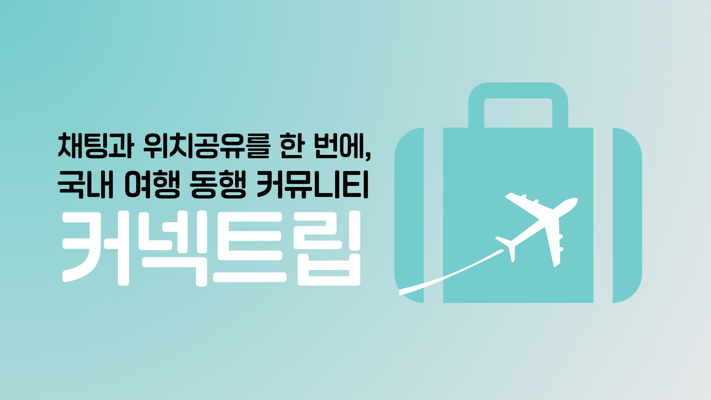
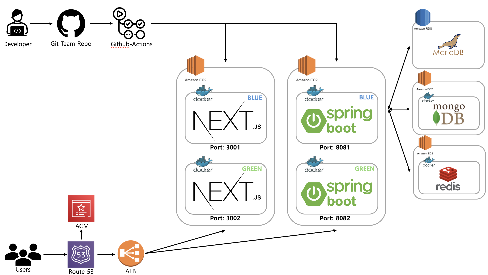

# ark - 커넥트립



국내 여행 동행 커뮤니티 **커넥트립**의 프론트엔드 레포지토리입니다. 백엔드는 [5-team-ark-connectrip-be](https://github.com/100-hours-a-week/5-team-ark-connectrip-be)에서 볼 수 있습니다.

## 팀원

|  |  |  |  |  |
|:------------------------------------------------:|:-------------------------------------------------:|:------------------------------------------------:|:-----------------------------------------------:|:-------------------------------------------------:|
|                seny.park (박세은)                 |                  eric.ha (하남규)                 |                 noah.jo (조태현)                 |                paz.kang (강지훈)                |                 true.choi (최진실)                |
|                        FE                        |                        BE                         |                        BE                        |                   BE / DevOps                   |                        BE                         |
|        [@sen2y](https://github.com/sen2y)        |      [@Namgyu11](https://github.com/Namgyu11)     |   [@49EHyeon42](https://github.com/49EHyeon42)   |    [@TopazKang](https://github.com/TopazKang)   |        [@trueS2](https://github.com/trueS2)       |

## 기술 스택

### Front

<div>
    
    
    
</div>

<div>
    
    
    
</div>

<div>
    
    
    
</div>

<div>
    
    
</div>

### Monitoring


### Lint & Format


### Deploy & Infra


## 배포 아키텍처



- `dev` 브랜치는 개발 서버, `main` 브랜치는 운영 서버에 배포
- GitHub Actions에서 환경 변수를 build-arg로 넣어 Docker 이미지를 빌드하고 GHCR에 push
- EC2의 Self-hosted Runner에서 Blue(3001) / Green(3002) 컨테이너를 전환하는 무중단 배포
- 인트로 이미지는 S3 + CloudFront로 전송

## 화면

| 동행 게시판 | 동행 채팅 | 동행 위치 공유 |
|:---:|:---:|:---:|
|  |  |  |

## 구현

### 사용자

- 카카오 OAuth2 로그인
    - Route Handler에서 카카오 인가 URL 생성, 리다이렉트 요청은 `rewrites`로 백엔드에 전달
    - 첫 로그인 시 닉네임, 생년월일, 성별, 약관 동의를 입력받아 회원가입 완료
- Next.js Middleware를 통한 페이지 접근 제어
    - 쿠키의 `accessToken`, `refreshToken`, `tempToken`으로 비로그인 / 추가 정보 미입력 / 로그인 사용자를 구분해 리다이렉트
- 닉네임 실시간 유효성 및 중복 검사 (디바운스 300ms)
- 프로필
    - 내 프로필, 다른 사용자 프로필 조회
    - 프로필 수정 (닉네임, 자기소개)
    - 받은 후기 목록 조회
- 로그인 전 서비스 소개 인트로 페이지

### 동행 게시물

- 페이지네이션을 통한 동행 게시물 목록 조회
- 동행 게시물 검색 (디바운스 300ms)
- 동행 게시물 상세 조회, 작성, 수정 및 삭제
    - 동행 지역 검색 선택, 지난 날짜와 시작일 이전 종료일 선택 제한
- 동행 신청 상태에 따른 버튼
    - 동행 신청 / 승인 대기 (신청 취소) / 채팅방으로 이동 / 모집 마감
- URL, 단축 URL 복사 및 QR 코드 이미지 복사를 통한 공유

### 동행 게시물 댓글

- 댓글 조회
- 댓글 작성, 수정 및 삭제 (256자 제한, 중복 등록 방지)

### 실시간 채팅 & 위치 공유

- STOMP, SockJS를 사용한 실시간 채팅
- 내 채팅 목록 (마지막 메시지, 상대 시간, 새 메시지 표시)
- IntersectionObserver와 마지막 메시지 ID를 사용한 이전 메시지 무한 스크롤
    - 이전 메시지를 불러올 때는 하단으로 이동하지 않고, 새 메시지를 받으면 하단으로 이동
- 날짜 구분선, 입장 및 퇴장 안내 메시지
- 메시지 속 링크 감지 및 썸네일 미리보기
    - Route Handler에서 cheerio로 OG 태그 스크래핑
    - 서버 메모리 캐시(1시간)와 sessionStorage 캐시로 같은 링크 중복 요청 제거
    - 썸네일 영역 크기 고정과 스켈레톤으로 로딩 중 레이아웃 흔들림 방지
- 채팅방 메뉴
    - 방장: 동행 신청 수락 및 거절, 모집 종료 / 동행 종료 상태 변경
    - 대화 상대 목록, 모집 게시글로 이동, 채팅방 나가기
- 카카오맵을 통한 위치 공유
    - 위치 추적 토글로 현재 위치(Geolocation API) 전송 및 공유 여부 설정
    - 동행들의 마지막 위치를 프로필 이미지 마커로 표시하고, `setBounds`로 모든 마커가 한 화면에 들어오게 조정
    - 위치 새로고침, 채팅방에 내 위치를 카카오맵 링크로 전송

### 동행 후기

- 동행 종료 후 대화 상대에게 후기 작성 (100자)
- 작성한 후기 조회

### 커뮤니티 게시물

- 페이지네이션을 통한 커뮤니티 게시물 목록 조회
- 커뮤니티 게시물 검색 (디바운스 300ms)
- 커뮤니티 게시물 상세 조회, 작성, 수정 및 삭제
- URL, 단축 URL, QR 코드를 통한 공유

### 커뮤니티 게시물 댓글

- 댓글 조회
- 댓글 작성, 수정 및 삭제 (256자 제한)

### 알림

- 사용자별 알림 채널을 WebSocket으로 구독해 새 채팅 메시지 알림 표시
    - 알림 클릭 시 해당 채팅방으로 이동
    - 채팅 목록의 마지막 메시지와 New 표시 실시간 갱신

### 모니터링 & SEO

- Sentry 에러 추적, Session Replay, 사용자 피드백 (개발 / 운영 환경 분리)
- Google Tag Manager 연동
- Metadata API로 title, description, Open Graph, Twitter 카드, canonical 설정

## 트러블슈팅

- **인트로 첫 이미지 로딩 최대 8.21초**
    - 원인: Next/Image가 캐시 MISS일 때 서버에서 이미지를 변환하는 시간, 운영 서버에 `sharp` 누락
    - 해결: `sharp` 설치, 첫 화면 이미지를 고정 크기 WebP로 만들어 S3 + CloudFront로 전송하고 `background-image`로 교체
    - 결과: **8.21s → 78ms (99.05% 개선)**
- **채팅 링크 썸네일 로딩 지연, 같은 링크 반복 스크래핑**
    - 해결: 서버 메모리 캐시와 sessionStorage 이중 캐싱, 썸네일 영역 크기 고정과 스켈레톤 적용
    - 결과: **4s → 1.62s (59.5% 단축)**, 같은 URL 요청 50회 → 1회
- **Safari에서만 QR 코드 클립보드 복사 실패**
    - 원인: 클릭 후 비동기로 이미지를 만드는 사이 사용자 제스처 컨텍스트가 끊겨 Safari가 복사를 거부
    - 해결: 모달을 열 때 html2canvas로 QR 이미지를 미리 만들고, 클릭 핸들러에서는 `ClipboardItem`으로 바로 복사
- **위치 추적 토글 시 지도가 동행 위치로 맞춰지지 않음**
    - 원인: 토글 순간 처음 뜨는 지도가 초기 `center`에 멈춤
    - 해결: `<Map>` 안에서 `useMap()`으로 지도를 받아 `setBounds`를 적용하는 컴포넌트 분리

<details>
    <summary>
        <h2>폴더 구조</h2>
    </summary>

```text
src
├── app
│   ├── (main)
│   │   ├── (auth)        # 회원가입, 프로필
│   │   ├── (policy)      # 이용약관, 개인정보 처리방침
│   │   ├── accompany     # 동행 게시물
│   │   ├── chat          # 채팅 목록, 채팅방
│   │   └── community     # 커뮤니티 게시물
│   ├── api
│   │   ├── kakaoAuth     # 카카오 인가 URL
│   │   └── scrape        # 링크 OG 태그 스크래핑
│   ├── components        # 화면별 UI 컴포넌트
│   ├── constants         # 페이지 접근 제어 경로
│   ├── data              # 동행 지역 목록
│   ├── hooks             # WebSocket, 카카오맵 로더, 공유 모달
│   ├── store             # Zustand (인증, 채팅방, 알림)
│   └── utils             # fetch 래퍼, API 함수, 날짜, 링크 변환
├── interfaces            # API 데이터, Props 타입
├── lib                   # OG 메타데이터 스크래핑, 캐시
├── types                 # 상태 타입
└── middleware.ts         # 쿠키 토큰 기반 페이지 접근 제어
```

</details>

<details>
    <summary>
        <h2>실행 방법</h2>
    </summary>

```bash
npm install --legacy-peer-deps
npm run dev
```

환경 변수 (`.env.local`)

```bash
KAKAO_API_KEY=
KAKAO_REDIRECT_URI=
NEXT_PUBLIC_SERVER_URL=
NEXT_PUBLIC_SELF_URL=
NEXT_PUBLIC_BASE_URL=
NEXT_PUBLIC_KAKAOJSKEY=
NEXT_PUBLIC_SENTRY_DSN=
SENTRY_AUTH_TOKEN=
NEXT_PUBLIC_GTM_ID=
```

</details>
